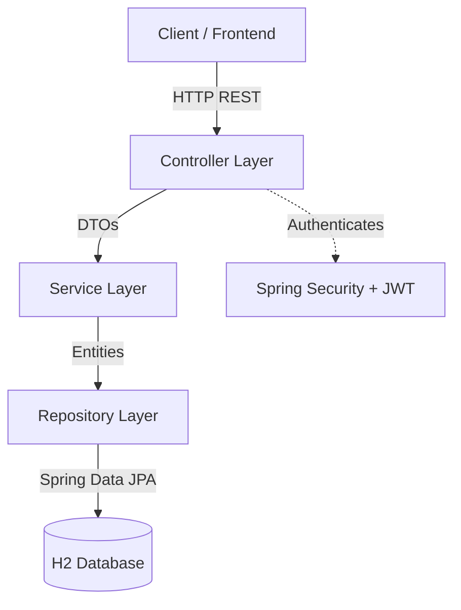
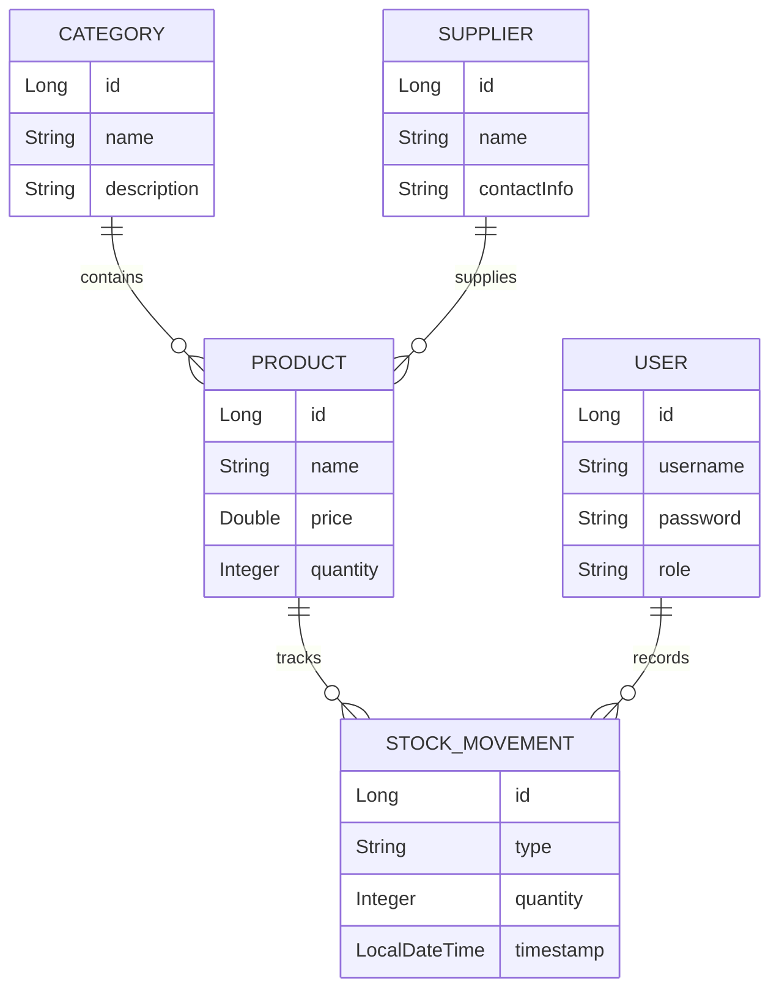
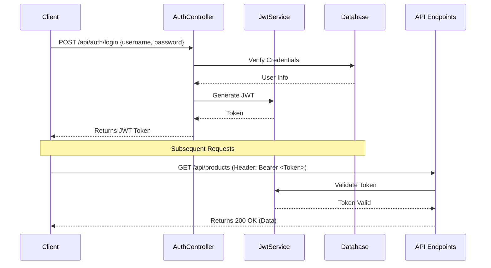

# Ventory

Ventory is a Java-based RESTful backend application built with **Spring Boot**. It is designed to be a robust, secure, and well-structured application, suitable for inventory management or similar domain-driven services.

## 🚀 Key Features

*   **RESTful Architecture**: Follows best practices with separated layers for `controller`, `service`, `repository`, `entity`, and `dto`.
*   **Secure Authentication**: Integrated with **Spring Security** and utilizes **JSON Web Tokens (JWT)** for stateless authentication and authorization.
*   **Data Persistence**: Leverages **Spring Data JPA** for ORM and data operations.
*   **In-Memory Database**: Pre-configured with the **H2 Database** for rapid development and testing without external database dependencies.
*   **Data Validation**: Implements robust request validation using Spring Boot Starter Validation.
*   **Clean Code**: Uses **Lombok** to reduce boilerplate code (getters, setters, constructors) and dedicated `mapper` classes for entity-to-DTO conversion.
*   **Exception Handling**: Custom, centralized error handling in the `exception` package.

## 🛠️ Technology Stack

*   **Language**: Java 21
*   **Framework**: Spring Boot
*   **Security**: Spring Security & JJWT (Java JWT)
*   **Database**: H2 (In-memory)
*   **ORM**: Spring Data JPA / Hibernate
*   **Build Tool**: Maven
*   **Utilities**: Lombok

## 🏗️ Architecture Diagram



## 🗄️ Entity Relationship Diagram (ERD)



## 🔐 Authentication Flow



## ⚙️ Running the Application

### Prerequisites
*   Java 21 installed
*   Maven installed (or use the provided `mvnw` wrapper)

### Steps to Run

1.  **Clone the repository** and navigate to the project directory:
    ```bash
    cd ventory
    ```

2.  **Run the application** using the Maven wrapper:
    ```bash
    ./mvnw spring-boot:run
    ```
    *On Windows use `mvnw.cmd spring-boot:run`*

3.  **Access the application**:
    By default, the application runs on `http://localhost:8080`.

### Database Console
The application uses an in-memory H2 database. You can access the database console while the application is running:
*   **URL**: `http://localhost:8080/h2-console`
*   **JDBC URL**: `jdbc:h2:mem:test`
*   **Username**: `sa` (or default if unconfigured)
*   **Password**: *(leave blank)*

## 📂 Project Structure

*   `src/main/java/org/example/ventory/`
    *   `controller/` - REST API endpoints.
    *   `dto/` - Data Transfer Objects.
    *   `entity/` - JPA Domain models.
    *   `enums/` - Enumerations used across the app.
    *   `exception/` - Custom exceptions and global handlers.
    *   `mapper/` - Logic for converting between Entities and DTOs.
    *   `repository/` - Spring Data JPA repositories.
    *   `service/` - Business logic implementation.

## 📖 API Documentation

The REST API endpoints follow standard conventions. Below is a high-level overview of the main resources:

### Authentication Endpoints
*   `POST /api/auth/register` - Register a new user.
*   `POST /api/auth/login` - Authenticate and receive a JWT.

### Product Endpoints
*   `GET /api/products` - Retrieve all products.
*   `GET /api/products/{id}` - Retrieve a specific product.
*   `POST /api/products` - Add a new product (Requires Auth).
*   `PUT /api/products/{id}` - Update a product (Requires Auth).
*   `DELETE /api/products/{id}` - Delete a product (Requires Auth).

### Supplier & Category Endpoints
*   Standard CRUD operations follow the same pattern at `/api/suppliers` and `/api/categories`.

## 🚀 Future Improvements

*   **API Documentation Generation**: Integrate Swagger/OpenAPI (SpringDoc) for automated, interactive API documentation.
*   **Database Migration**: Introduce Flyway or Liquibase for versioned database schema migrations instead of relying on Hibernate `ddl-auto`.
*   **Caching**: Implement Redis or Spring Cache to optimize read-heavy operations like fetching product catalogs.
*   **Testing**: Expand unit and integration test coverage using JUnit and Testcontainers.
*   **CI/CD Pipeline**: Setup automated GitHub Actions workflows for building, testing, and linting the application.